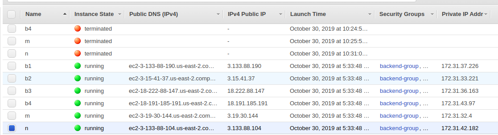

# Домашка по хайлоаду номер 2: балансировка всего на свете

## Что надо поменять, чтобы заработало у вас:
 
Файлы все лежат в директории ansible_files:
 + hosts: там перечислены группы серверов, 
 они подписаны - заменить там
 айпи адреса на те ПУБЛИЧНЫЕ адреса,
  которые вам дает хостинг (некоторые хостинги, например AWS, 
  выдают помимо белых доступных айпи адресов еще
   приватные, чтобы сервера в кластере общались между собой)
   + там же надо поменять ansible_ssh_private_key_file 
   на путь до файла ПРИВАТНОГО ssh ключа, с которым вы заходите
   на сервера по ssh
 + в файлах backend.yml, monitoring.yml и nginx.yml надо поменять
 переменную server_user на того пользователя, которого вам по дефолту
 дает провайдер (у меня на AWS это убунту)
 + в файле roles/monitoring/files/prometheus/prometheus.yml надо 
 поправить конфиг прометеуса в соответствии со своими адресами, если
 есть приватные адреса сервисов - лучше указать их, если нет - 
 указываете публичные адреса бекендов и балансировщика (по адресу nginx на 9113 порту вертится exporter статистик nginx для прометеуса) и молитесь чтобы это все не 
 было пипец как медленно (как править конфиг прометеуса не буду
 объяснять - если не умеете, это дз не для вас)
 + в файле roles/nginx/files/nginx.conf надо поправить конфиг нгинкса
 в соответствии с адресами серверов, которые у вас есть
    + правило то же, если есть приватные адреса - указываете их


### Предварительно ставим ansible самой последней версии:
Код для убунты
```
$ sudo apt update
$ sudo apt install software-properties-common
$ sudo apt-add-repository --yes --update ppa:ansible/ansible
$ sudo apt install ansible
```

### Для выкатки бекендов:
```
$ pwd
<path-to-your-project>/sample_slow_service
$ cd ansible_files
$ ansible-playbook -i hosts backend.yml
```

### Для мониторинга:
```
$ pwd
<path-to-your-project>/sample_slow_service
$ cd ansible_files
$ ansible-playbook -i hosts monitoring.yml
```

### Для выкатывания балансера
```
$ pwd
<path-to-your-project>/sample_slow_service
$ cd ansible_files
$ ansible-playbook -i hosts nginx.yml
```
### Для того чтобы посмотреть графики:
 + заходим на <ip-сервера-мониторинга>:3000, там уже
 готовая grafana, dashboard уже есть
 
P.S. это демонстрационная версия, если охота переписать - разбирайтесь в 
ansible и том что я тут написал, тут все не очень сложно, если чуть чуть поправите
скрипты в ansible_files то сможете кастомизировать домашку под себя и
выкатывать все одной кнопкой, то есть изменил код бекенда - одной командой
ansible все развернул и все работает
